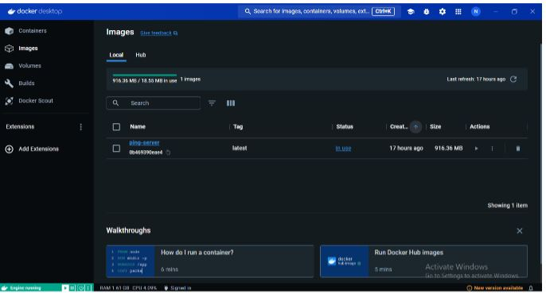

# Docker

This project is a simple Node.js server that responds to ping requests. It is packaged in a Docker container for easy deployment.

## Prerequisites

Ensure you have the following installed on your system:

- [Node.js](https://nodejs.org/)
- [Docker Desktop](https://www.docker.com/products/docker-desktop)
- [Git](https://git-scm.com/)

## Project Structure

ping-server/
│
├── server.js
├── Dockerfile
├── package.json
└── package-lock.json

## Getting Started

Follow these instructions to set up and run the project locally using Docker.

### Step 1: Clone the Repository

Clone this repository to your local machine:

git clone https://github.com/your-username/ping-server.git
Navigate to the project directory:

cd ping-server

### Step 2: Write a Simple Node.js Ping Server
Create a file named server.js with the following content:

// server.js
const express = require('express');
const app = express();
const port = process.env.PORT || 3000;

app.get('/ping', (req, res) => {
  res.send('pong');
});

app.listen(port, () => {
  console.log(`Ping server is running on port ${port}`);
});
Step 3: Create a Dockerfile
Create a file named Dockerfile with the following content:

-Use the official Node.js image from the Docker Hub
FROM node:14

-Create and set the working directory
WORKDIR /usr/src/app

-Copy package.json and package-lock.json
COPY package*.json ./

-Install the dependencies
RUN npm install

-Copy the rest of the application code
COPY . .

-Expose the port the app runs on
EXPOSE 3000

-Command to run the app
CMD ["node", "server.js"]

### Step 4: Create a package.json File
Create a file named package.json with the following content:

{
  "name": "ping-server",
  "version": "1.0.0",
  "description": "A simple ping server",
  "main": "server.js",
  "scripts": {
    "start": "node server.js"
  },
  "dependencies": {
    "express": "^4.17.1"
  }
}
### Step 5: Build and Run the Docker Container
Build the Docker image:

docker build -t ping-server .
Run the Docker container:

docker run -p 3000:3000 ping-server
The Node.js ping server should now be running inside a Docker container and accessible at http://localhost:3000/ping.

## License
This project is licensed under the MIT License.

## Contributing
Contributions are welcome! Please feel free to submit a pull request.

## Contact
If you have any questions, feel free to reach out at shree150902@gmail.com.

This `README.md` provides a comprehensive guide to setting up, building, and running your Dockerized Node.js ping server.
